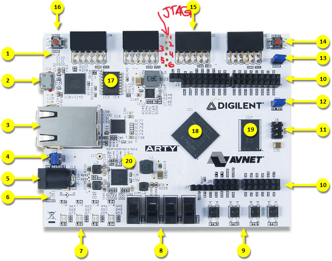
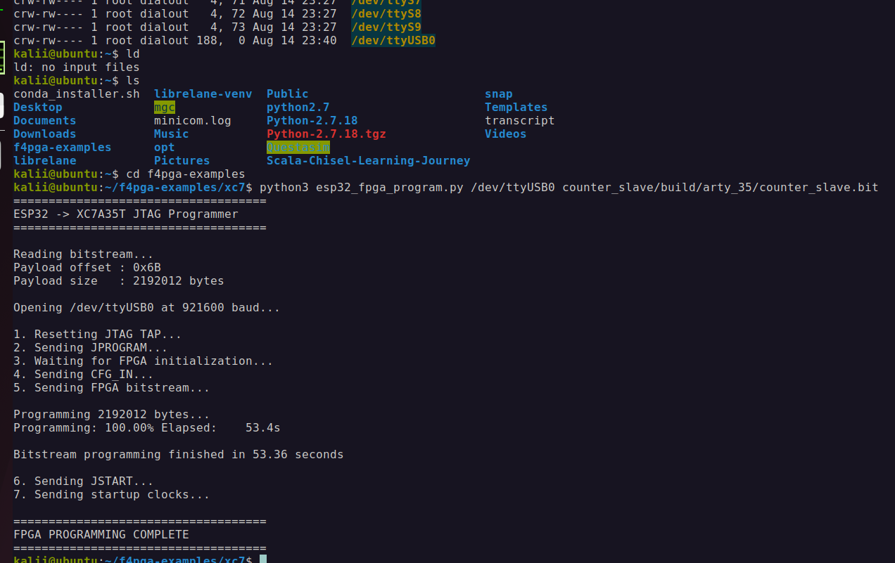

# esp32-fpga-jtag-programmer
A custom ESP32-based JTAG programmer for configuring Xilinx 7-Series FPGAs using F4PGA-generated bitstreams.


## 🎥 Project Video

Watch the complete project demonstration on YouTube:

<p align="left">
  <a href="https://www.youtube.com/watch?v=xM9_fCcTvvQ">
    
  </a>
</p>

<p align="left">
  ▶️ <a href="https://www.youtube.com/watch?v=xM9_fCcTvvQ">
    Watch the full video on YouTube
  </a>
</p>


````markdown

This project allows an ESP32 to act as a JTAG programmer and configure an FPGA directly through the JTAG interface.

## Overview

The programming flow is:

Verilog / HDL
     │
     ▼
   F4PGA
     │
     ▼
Xilinx .bit File
     │
     ▼
Python Uploader
     │
 USB Serial
     │
     ▼
   ESP32
     │
 Custom JTAG
     │
     ▼
Xilinx 7-Series FPGA
````

The ESP32 receives the FPGA bitstream from the computer and transfers it to the FPGA using the JTAG interface.

---

# Features

* ESP32-based custom JTAG programmer
* Programs Xilinx 7-Series FPGAs
* Compatible with F4PGA-generated `.bit` files
* JTAG TAP reset
* FPGA programming using `JPROGRAM`
* Bitstream configuration using `CFG_IN`
* FPGA startup using `JSTART`
* Command-line selection of serial port
* Command-line selection of bitstream file
* No onboard FPGA USB-JTAG programmer required

---

# Tested Hardware

| Hardware                    | Status |
| --------------------------- | ------ |
| ESP32                       | Tested |
| Arty A7-35T                 | Tested |
| XC7A35T                     | Tested |
| F4PGA-generated `.bit` file | Tested |

The same approach can be adapted for other compatible Xilinx 7-Series FPGAs, provided that the correct bitstream is generated for the target FPGA.

---

# Hardware Required

* ESP32 development board
* Xilinx FPGA development board
* Jumper wires
* USB cable for ESP32
* Ubuntu or Linux PC
* Python 3
* F4PGA toolchain

---

# ESP32 to Arty A7 JTAG Connections

Connect the ESP32 directly to the FPGA JTAG pins.

| ESP32 GPIO | JTAG Signal | FPGA |
| ---------- | ----------- | ---- |
| GPIO 13    | TCK         | TCK  |
| GPIO 27    | TDI         | TDI  |
| GPIO 26    | TDO         | TDO  |
| GPIO 25    | TMS         | TMS  |
| GND        | GND         | GND  |

## Connection Image

<p align="center">
	
</p>

The connection direction is:

```text
ESP32                      FPGA

GPIO 13 ────────────────► TCK(1)

GPIO 25 ────────────────► TMS(2)

GPIO 27 ────────────────► TDI(3)

GPIO 26 ◄──────────────── TDO(4)

GND     ───────────────── GND(6)

pin no 6 that is 3.3v pin on fpga jtag pins is not used
```

> **Important:** The ESP32 and FPGA must share a common ground.

---

# Voltage Considerations

ESP32 GPIO operates at:

```text
3.3V
```

Before connecting the ESP32 to the FPGA JTAG interface, verify the voltage level of the JTAG pins.

For a 3.3V JTAG interface, the signals can be connected directly:

```text
ESP32 GPIO ─────────► FPGA JTAG
```

Do not connect 5V signals directly to ESP32 GPIO pins.

---

# Project Structure

```text
esp32-fpga-jtag-programmer/
│
├── ESP32_JTAG/
│   └── ESP32_JTAG.ino
│
├── bitstream_upload_python_code/
│   └── esp32_fpga_program.py
│
├── images/
│   ├── upload_cmd.png
│   └── arty_jtag_pins.png
│
└── README.md
```

---

# Installation

## 1. Clone the Repository

Clone the repository:

```bash
git clone <repository-url>
```

Enter the project directory:

```bash
cd esp32-fpga-jtag-programmer
```

---

## 2. Install Python

Check that Python 3 is installed:

```bash
python3 --version
```

Install the required Python package:

```bash
pip3 install pyserial
```

---

# Upload the ESP32 Firmware

Open the ESP32 firmware using the Arduino IDE.

Select:

* Your ESP32 board
* The correct serial port

Upload the ESP32 JTAG programmer firmware.

After uploading the firmware, connect the ESP32 to the computer through USB.

---

# Find the ESP32 Serial Port

On Ubuntu, check for connected serial devices:

```bash
ls /dev/ttyUSB*
```

You may see:

```text
/dev/ttyUSB0
```

Some boards may appear as:

```bash
ls /dev/ttyACM*
```

For example:

```text
/dev/ttyACM0
```

You can also check using:

```bash
dmesg | grep tty
```

---

# Generate the FPGA Bitstream

Generate your FPGA design using F4PGA.

Make sure that the FPGA part matches the FPGA installed on your development board.

For example:

## Arty A7-35T

```text
XC7A35TCSG324-1
```

## Arty A7-100T

```text
XC7A100TCSG324-1
```

Build your design using your F4PGA flow.

For example:

```bash
TARGET="arty_35" make -C FOLDER_NAME
```

After a successful build, a `.bit` file will be generated.

Example:

```text
build/arty_35/counter_slave.bit
```

---

# Uploading the Bitstream

The Python uploader accepts two arguments:

```text
python3 esp32_fpga_program.py <serial_port> <bitstream_file_location>
```

For example:

```bash
python3 esp32_fpga_program.py /dev/ttyUSB0 build/arty_35/counter_slave.bit
```

The first argument is the ESP32 serial port:

```text
/dev/ttyUSB0
```

The second argument is the FPGA bitstream:

```text
build/arty_35/counter_slave.bit
```

## Upload Command Example

<p align="center">
	
</p>

---

# Programming Sequence

The FPGA configuration process follows this sequence:

```text
Start
  │
  ▼
Reset JTAG TAP
  │
  ▼
JPROGRAM
  │
  ▼
Wait for FPGA Initialization
  │
  ▼
CFG_IN
  │
  ▼
Send Bitstream
  │
  ▼
JSTART
  │
  ▼
FPGA Starts Running
```

The programming tool automatically handles the FPGA configuration sequence.

Once programming is complete, the FPGA starts running the uploaded design.

---

# Using Different Bitstreams

You do not need to modify the Python uploader when programming a different FPGA design.

Simply provide the new `.bit` file:

```bash
python3 esp32_fpga_program.py /dev/ttyUSB0 path/to/design.bit
```

For example:

```bash
python3 esp32_fpga_program.py /dev/ttyUSB0 build/arty_35/counter_slave.bit
```

Or:

```bash
python3 esp32_fpga_program.py /dev/ttyUSB0 build/arty_100/top.bit
```

---

# Using a Different Serial Port

If your ESP32 appears as `/dev/ttyUSB1`:

```bash
python3 esp32_fpga_program.py /dev/ttyUSB1 build/arty_35/counter_slave.bit
```

If your ESP32 appears as `/dev/ttyACM0`:

```bash
python3 esp32_fpga_program.py /dev/ttyACM0 build/arty_35/counter_slave.bit
```

---

# Troubleshooting

## Serial Port Not Found

Check available serial ports:

```bash
ls /dev/ttyUSB*
```

or:

```bash
ls /dev/ttyACM*
```

Make sure the ESP32 is connected properly.

---

## Permission Denied

If you receive:

```text
Permission denied: /dev/ttyUSB0
```

Add your user to the `dialout` group:

```bash
sudo usermod -a -G dialout $USER
```

Then log out and log back in.

---

## FPGA Does Not Configure

Check the following:

* ESP32 and FPGA share a common GND.
* TCK is connected correctly.
* TMS is connected correctly.
* TDI is connected correctly.
* TDO is connected correctly.
* The FPGA board is powered.
* The `.bit` file matches the FPGA device.
* The correct serial port is selected.
* No other programmer is driving the JTAG interface.

---

# Supported Programming Flow

```text
┌───────────────┐
│ Verilog / HDL │
└───────┬───────┘
        │
        ▼
┌───────────────┐
│     F4PGA     │
└───────┬───────┘
        │
        ▼
┌───────────────┐
│   .bit File   │
└───────┬───────┘
        │
        ▼
┌───────────────┐
│ Python Tool   │
└───────┬───────┘
        │
        │ USB Serial
        ▼
┌───────────────┐
│     ESP32     │
│ Custom JTAG   │
└───────┬───────┘
        │
        │ TCK
        │ TMS
        │ TDI
        │ TDO
        ▼
┌───────────────┐
│ Xilinx FPGA   │
└───────────────┘
```

---

# Future Improvements

Possible future improvements include:

* [ ] ESP32-S3 native USB support
* [ ] Faster bitstream transfer
* [ ] Higher JTAG clock speed
* [ ] FPGA IDCODE detection
* [ ] Automatic FPGA detection
* [ ] Configuration status verification
* [ ] Support for additional Xilinx 7-Series devices
* [ ] GUI-based FPGA programming tool
* [ ] Faster GPIO implementation

---

# Author

**Hammad Ahmed**

Electrical Engineering | Embedded Systems | FPGA | RTL Design

GitHub: `the-hammadahmed`

---

# License

This project is open source.

---

⭐ If you find this project useful, consider giving the repository a star.


